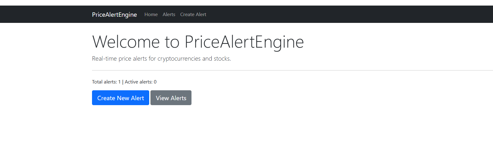
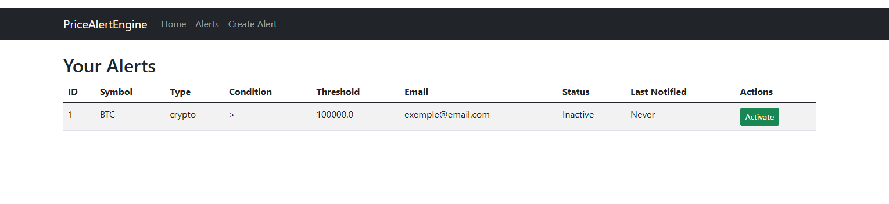
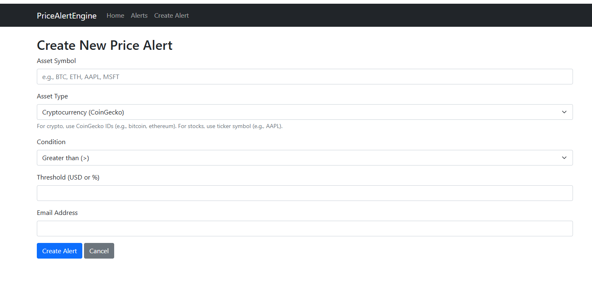

# Price Alert Engine – Real‑Time Crypto/Stock Alerts

[](https://python.org)
[](https://flask.palletsprojects.com)
[](https://sqlite.org)
[](LICENSE)

> A web‑based system to create price alerts for cryptocurrencies and stocks. Alerts are checked in real‑time and emails are sent when the price crosses the target threshold.





---

## Features

- 👤 **User Accounts** – Each user has their own set of alerts.
- 🚀 **Real‑time Alerts** – Uses APScheduler to check prices every minute.
- 📧 **Email Notifications** – Sends emails when an alert triggers.
- 📈 **Price Data** – Fetches current prices from CoinGecko (crypto) and Alpha Vantage (stocks).
- 🖥️ **Web Interface** – Add, edit, and delete alerts with a clean Bootstrap UI.

---

## Tech Stack

- **Backend**: Python, Flask, Flask‑SQLAlchemy, Flask‑Login, APScheduler
- **Database**: SQLite (or PostgreSQL)
- **APIs**: CoinGecko, Alpha Vantage
- **Frontend**: Bootstrap 5, Jinja2 templates

---

## Why I Built This

I wanted a tool to monitor price movements without constantly checking exchanges. This project demonstrates my ability to integrate external APIs, handle background scheduling, and build a user‑friendly web interface.

---

## Setup Instructions

### Prerequisites
- Python 3.8+
- API keys for CoinGecko (free) and Alpha Vantage (free)

### Clone and Install
```bash
git clone https://github.com/tayebmekati37-art/price-alert-engine.git
cd price-alert-engine
python -m venv venv
source venv/bin/activate  # or venv\Scripts\activate on Windows
pip install -r requirements.txt
